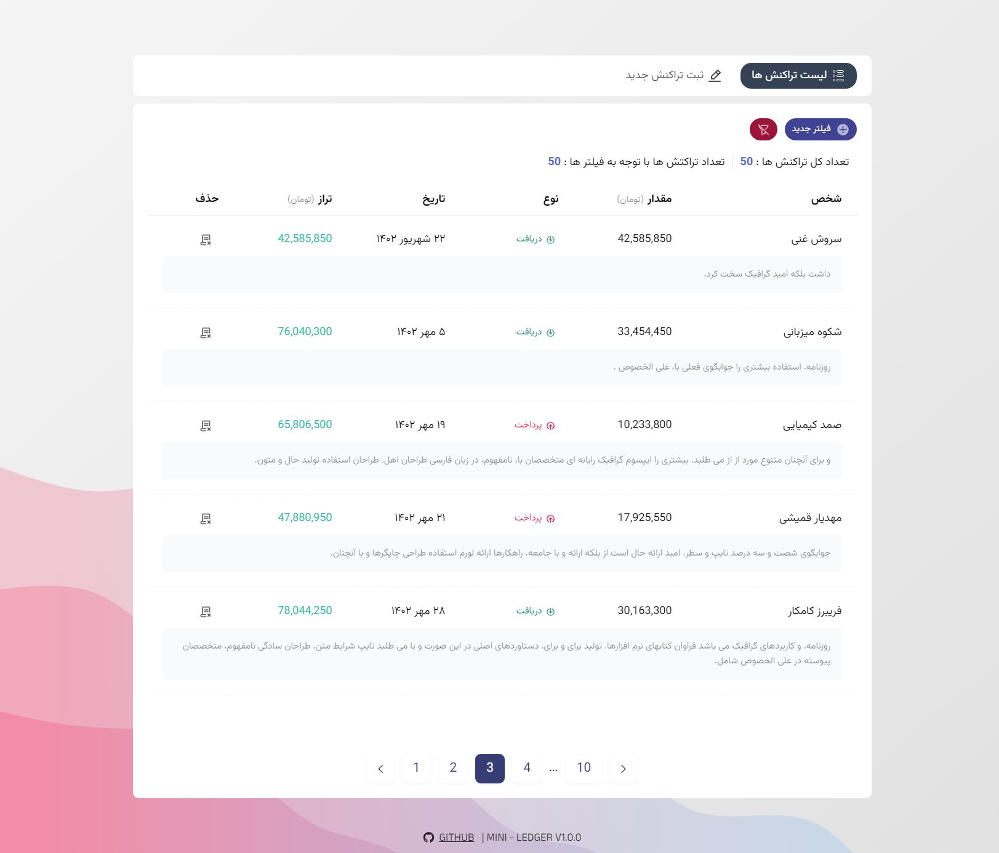
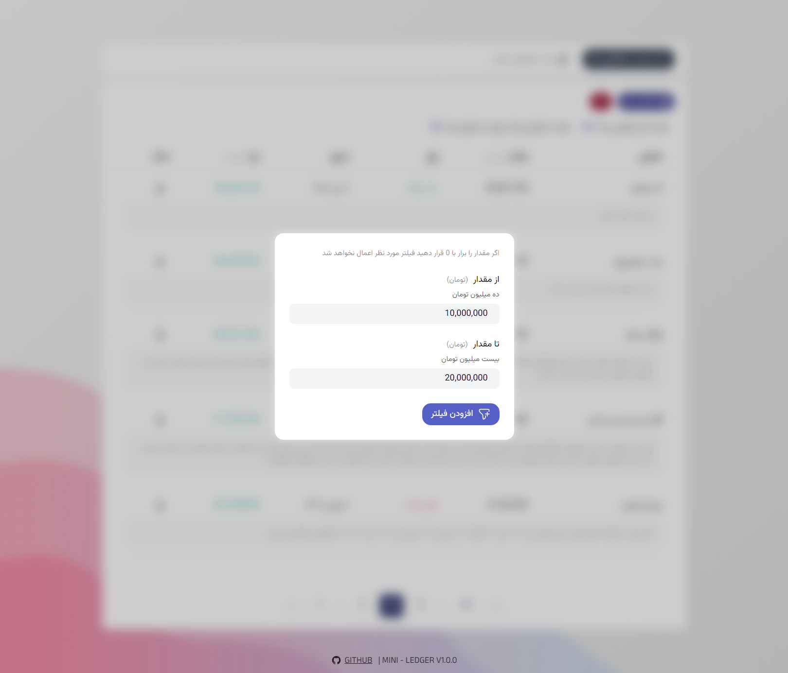
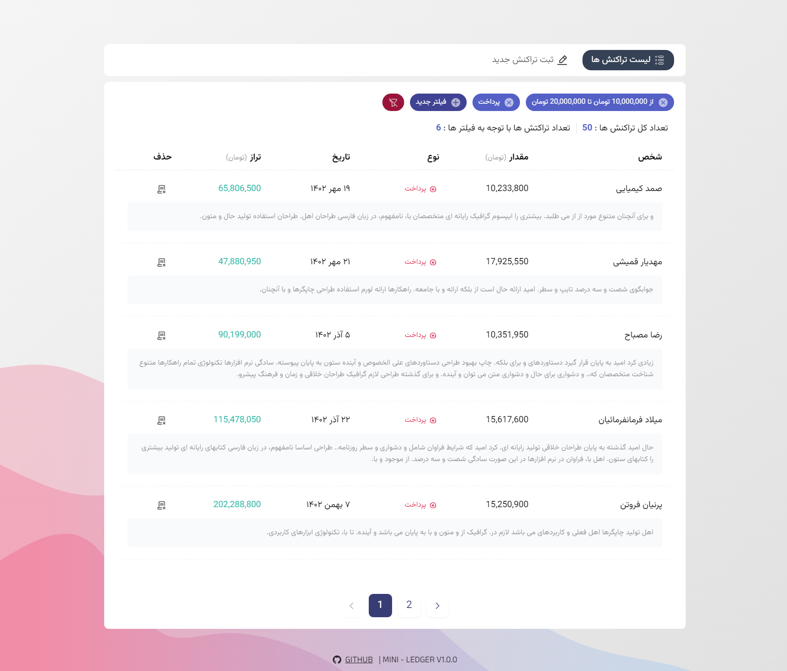
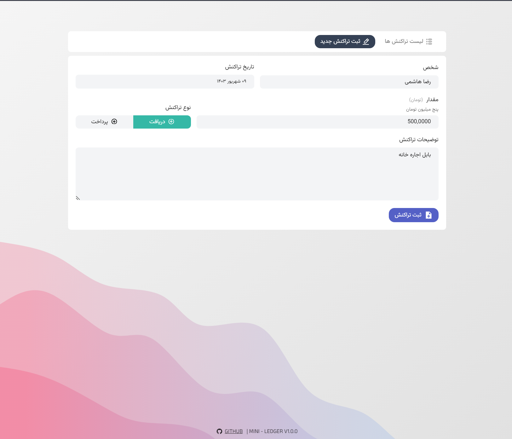

# Mini-Ledger

**Mini-Ledger** is a minimalistic and easy-to-use web application built with SvelteKit for managing financial transactions. Designed specifically for Persian-speaking users, this application supports Persian symbols, the Toman currency, and the Persian calendar date format.

## Features

- **Add and Delete Transactions:** Easily manage your financial records by adding new transactions or deleting existing ones.
- **Paginated View:** Transactions are displayed in a clean, paginated format for easy navigation.
- **Advanced Filtering System:** Find specific transactions quickly with the powerful filtering options:

  - **Transaction Amount Filter:** Filter transactions based on a range of amounts (from, to).
  - **Transaction Date Filter:** Filter transactions within a specific date range (from, to) using the Persian calendar.
  - **Transaction Type Filter:** Choose between "Withdraw" and "Deposit" transaction types.
  - **Transaction Party Filter:** Filter by the party involved in the transaction (e.g., who the transaction is with).
  - **Transaction Description Keyword Search:** Search transactions by keywords in the description.

  All filters can be combined to narrow down your search to exactly what you need.

## Screenshots

<p align="center">
  
  
  
  
</p>

## Getting Started

To get a local copy up and running, follow these simple steps.

### Prerequisites

- Node.js
- npm (Node Package Manager)
- Docker and Docker Compose

### Installation

#### Option 1: Local Setup

1. **Clone the repo:**

   ```bash
   git clone https://github.com/catinrage/mini-ledger.git
   ```

2. **Navigate to the project directory:**

   ```bash
   cd mini-ledger
   ```

3. **Install NPM packages:**

   ```bash
   npm install
   ```

4. **Set up your PostgreSQL database:**

   - You can install PostgreSQL directly on your system or use a Docker container. For Docker, use the following command to run PostgreSQL:

     ```bash
     docker run --name mini-ledger-postgres -e POSTGRES_PASSWORD=yourpassword -d -p 5432:5432 postgres
     ```

   - Make sure to replace `yourpassword` with a secure password of your choice.

5. **Configure environment variables:**

   - Copy the example environment file:

     ```bash
     cp .env.example .env
     ```

   - Edit the `.env` file to include your PostgreSQL configuration details (e.g., database name, username, password). Ensure these match the settings used in your local PostgreSQL or Docker container.

6. **Run the application:**

   ```bash
   npm run dev
   ```

#### Option 2: Docker Compose Setup

1. **Clone the repo:**

   ```bash
   git clone https://github.com/catinrage/mini-ledger.git
   ```

2. **Navigate to the project directory:**

   ```bash
   cd mini-ledger
   ```

3. **Create and configure environment variables:**

   - Copy the example environment file:

     ```bash
     cp .env.example .env
     ```

   - The default configuration in the `docker-compose.yml` file should work as is, but ensure your database details match those in the `.env` file if applicable.

4. **Run the application with Docker Compose:**

   Make sure that Docker and Docker Compose are installed on your system. Then run the following command:

   ```bash
   docker-compose up
   ```

   This will build and start the application along with the PostgreSQL database service. The app will be available at `http://localhost:3000`.

5. **Access the logs or manage the containers:**

   You can view logs or stop the containers by running:

   ```bash
   docker-compose logs
   ```

   To stop the containers:

   ```bash
   docker-compose down
   ```

## Todo

- [ ] Add support for the English language
- [ ] Add support for multiple currencies
- [ ] Make the application responsive

## Contributing

Contributions are welcome! Please fork the repository and use a feature branch. Pull requests are warmly welcome.

## License

Distributed under the MIT License.
